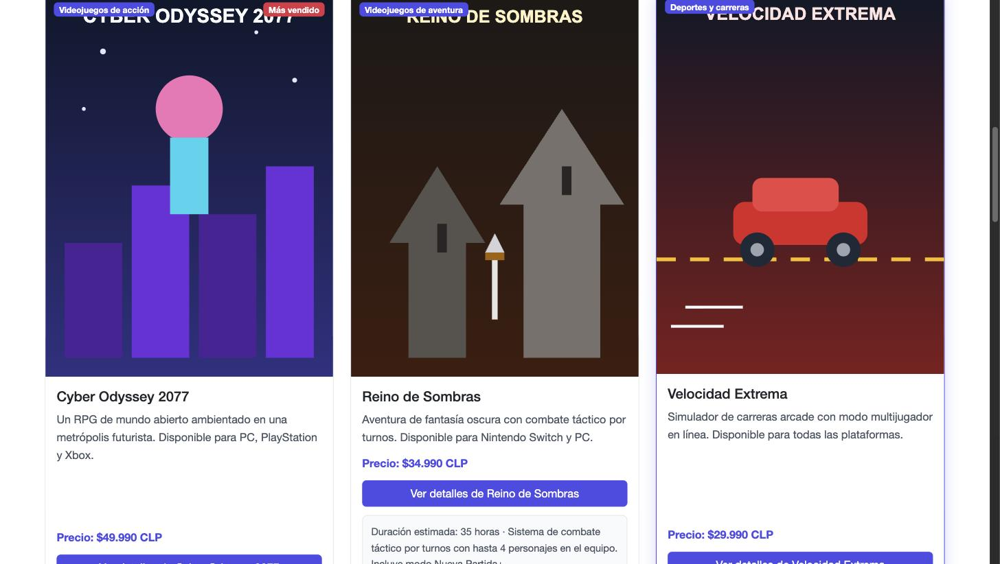
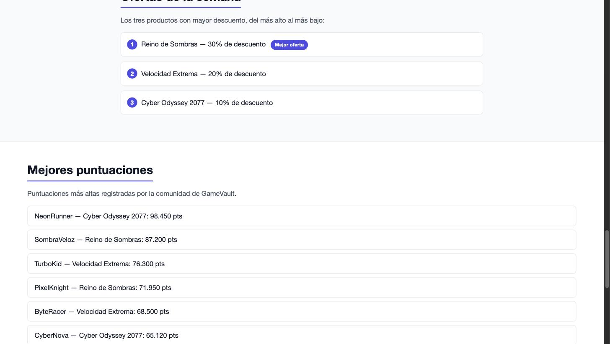
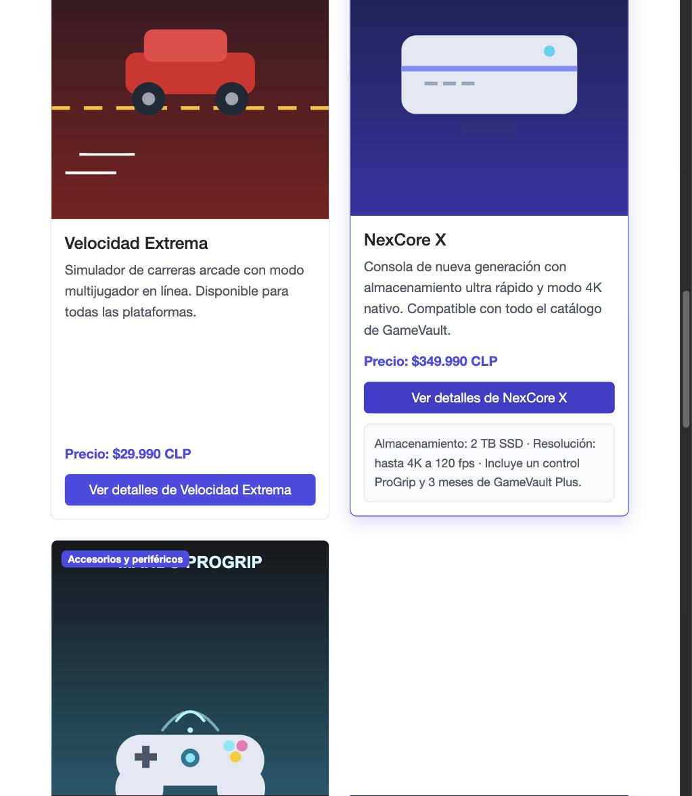
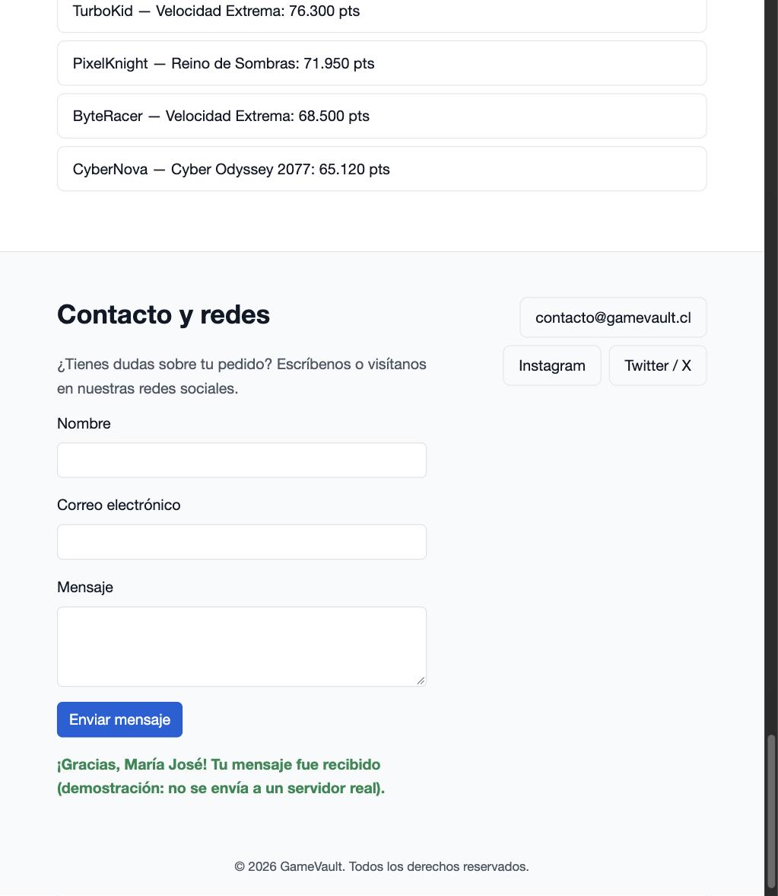
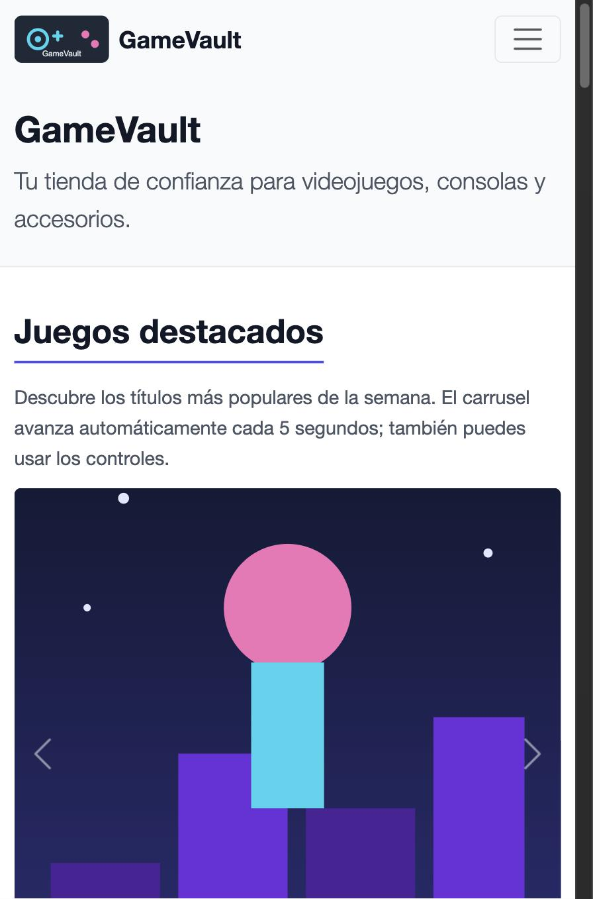
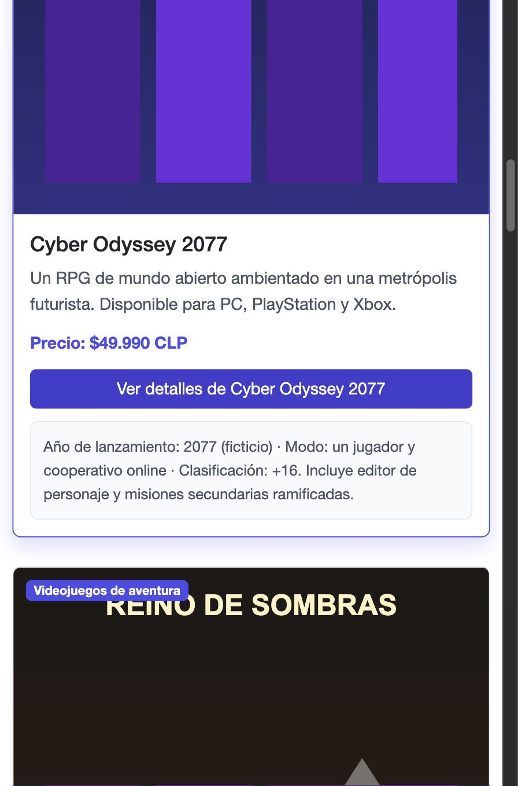
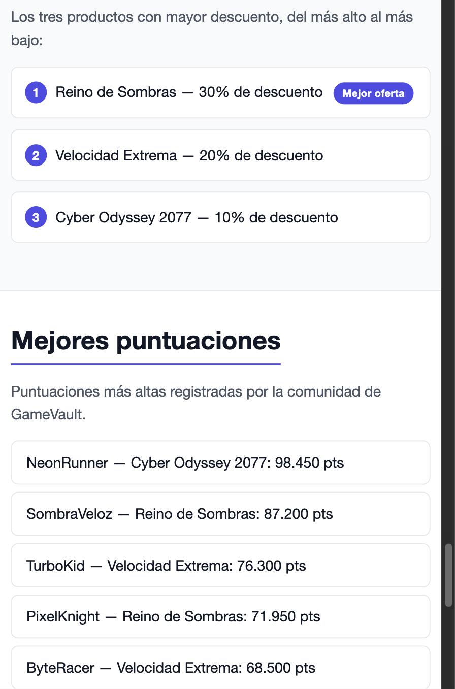
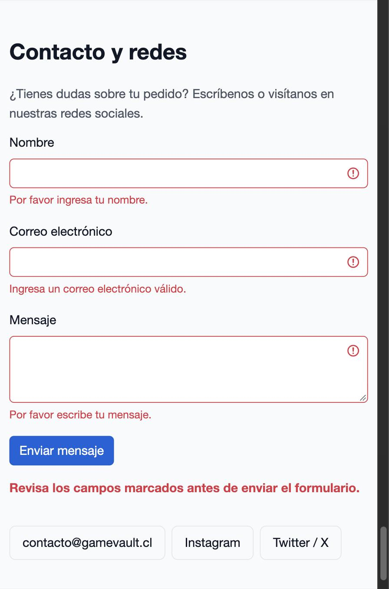

# GameVault

Tienda online de videojuegos, consolas y accesorios. Página estática construida con HTML semántico, CSS propio y **Bootstrap 5**.

## Sitio publicado

**GitHub Pages:** [https://gustavoduocuc.github.io/video-game-basic/](https://gustavoduocuc.github.io/video-game-basic/)

## Tecnologías

- HTML5 semántico (`header`, `nav`, `main`, `section`, `article`, `footer`)
- CSS3 con variables personalizadas (tema GameVault)
- **Bootstrap 5.3.8** vía CDN (jsDelivr)
  - Navbar responsiva con colapso (hamburguesa)
  - Carousel con autoplay, indicadores y controles
  - Sistema de grillas (`container` / `row` / `col-*`)
  - Cards para el catálogo de productos

## Contenido

| Archivo / carpeta | Descripción |
|-------------------|-------------|
| `index.html` | Página principal: navbar, carrusel, catálogo, categorías, ofertas y footer |
| `styles.css` | Overrides del tema y estilos propios (carga después de Bootstrap) |
| `assets/` | Imágenes SVG del logo y portadas de productos |

## Uso local

Abrir `index.html` directamente en el navegador (no requiere servidor ni instalación):

```bash
open index.html
```

Se necesita conexión a internet la primera vez para cargar Bootstrap desde el CDN.

## Componentes Bootstrap usados

1. **Navbar** (`navbar-expand-lg` + `navbar-toggler`): colapsa bajo 992px.
2. **Carousel** (`data-bs-ride="carousel"`, `data-bs-interval="5000"`): juegos destacados cada 5 s.
3. **Grid**: catálogo en `col-12 col-sm-6 col-lg-4`; categorías en `col-6 col-md-4 col-lg`.
4. **Cards**: productos con altura uniforme (`h-100`) y botones `btn-primary`.

## Estructura semántica

La página usa una jerarquía de encabezados `<h1>`–`<h3>`, listas para ofertas, enlaces descriptivos e imágenes con texto alternativo.

## Cómo se ve

Capturas actualizadas con la interactividad JS: detalle de producto expandible (click), catálogo, puntuaciones cargadas vía Fetch API y validación del formulario de contacto (submit).

### Desktop



### Tablet



### Mobile





## Validación

HTML validado con https://jsonformatter.org/html-validator
