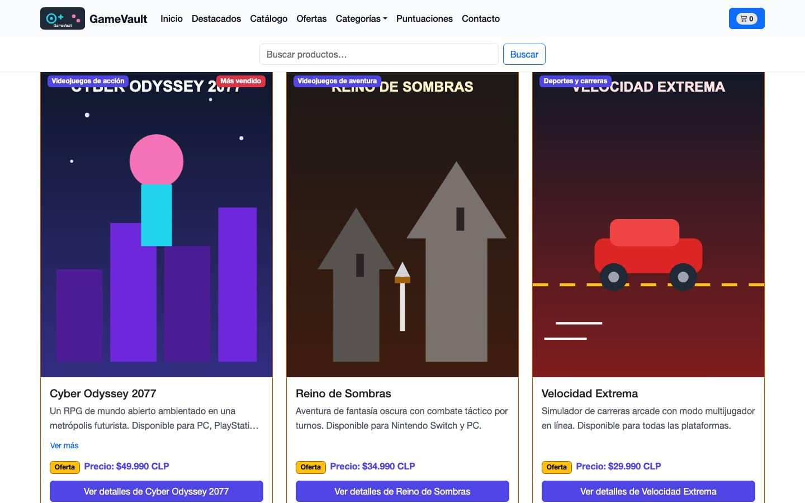
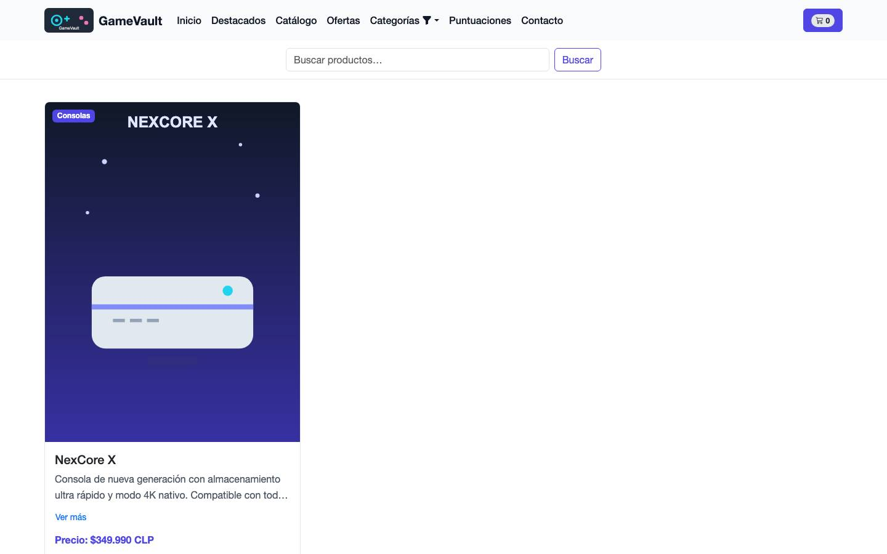
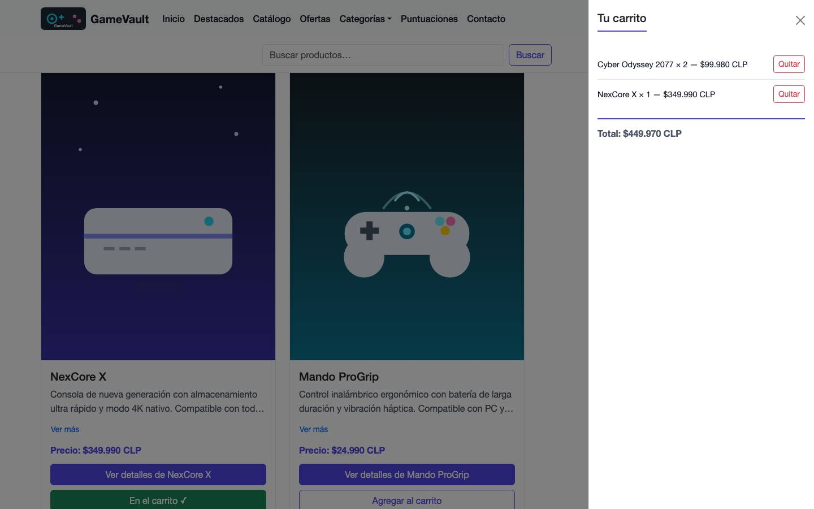
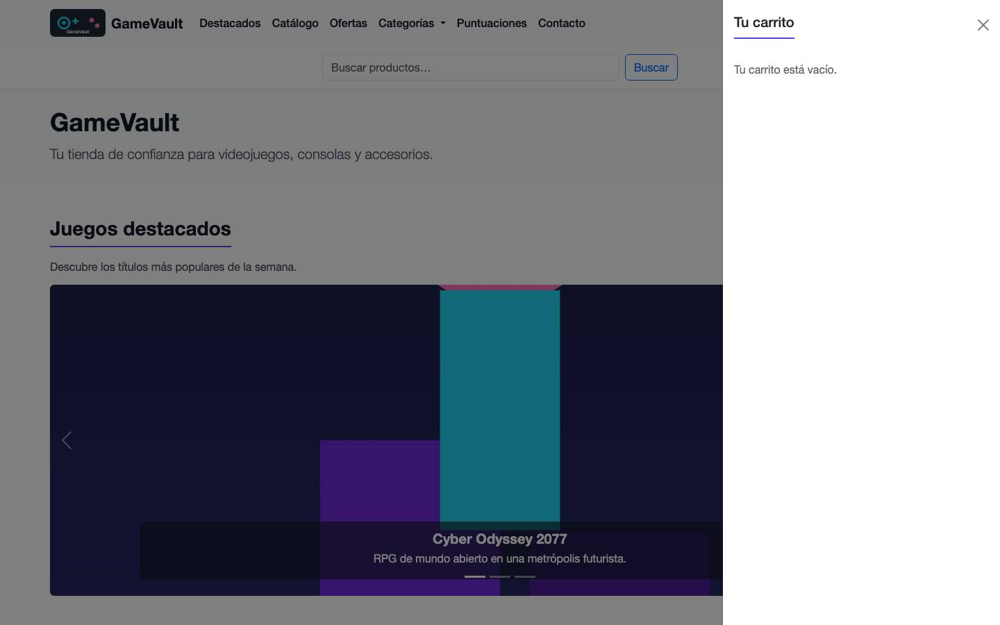
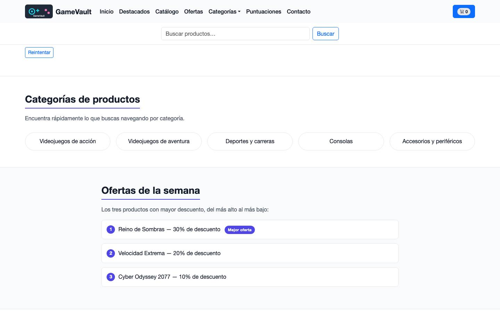
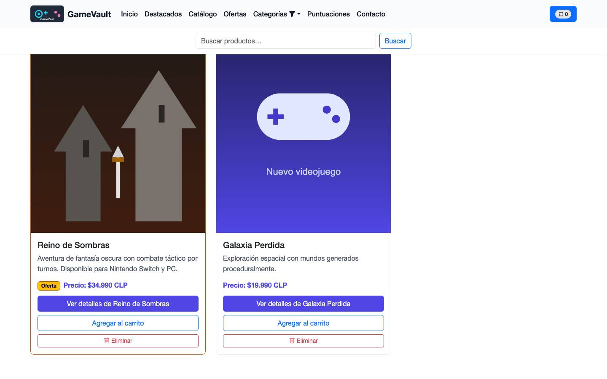

# GameVault

Tienda online de videojuegos, consolas y accesorios. Construida con HTML semántico, CSS propio, **Bootstrap 5** y **React** (Vite) para la navegación, el catálogo, los filtros, el carrito y el formulario de contacto.

## Sitio publicado

**GitHub Pages:** [https://gustavoduocuc.github.io/video-game-basic/](https://gustavoduocuc.github.io/video-game-basic/)

## Tecnologías

- HTML5 semántico (`header`, `nav`, `main`, `section`, `article`, `footer`)
- CSS3 con variables personalizadas (tema GameVault)
- **Bootstrap 5.3.8** vía CDN (jsDelivr)
  - Navbar responsiva con colapso (hamburguesa), buscador y dropdown de categorías
  - Carousel con autoplay, indicadores y controles
  - Sistema de grillas (`container` / `row` / `col-*`)
  - Cards para el catálogo de productos
  - Offcanvas para el resumen del carrito de compras
- **React 19 + Vite**: componentes funcionales para la barra de navegación, el catálogo (con alta y baja de videojuegos), el buscador, los filtros de categorías, el carrito y el formulario de contacto, montados sobre el mismo HTML/CSS de Bootstrap (ver "Arquitectura de la app de React" más abajo)
- El resto de la página (carrusel, ofertas y puntuaciones) sigue siendo HTML + JavaScript vainilla con módulos ES

## Contenido

| Archivo / carpeta | Descripción |
|-------------------|-------------|
| `index.html` | Punto de entrada de Vite: estructura semántica (`header`, `main`, `section`, `footer`) con el carrusel, las ofertas y las puntuaciones, y los contenedores donde React monta el navbar, el catálogo, los chips de categorías, el carrito y el contacto |
| `src/` | App de React: `App.jsx` (ensambla todo y reparte el estado por props), `components/`, `hooks/` (`useCatalog`, `useCart`, `useToast`), `data/` y `utils/` (formato, validación de formularios y creación de productos) |
| `vite.config.js` | Configuración de Vite (plugin de React, `base: './'`) |
| `public/styles.css` | Archivo principal de estilos; importa las hojas temáticas en el orden de la cascada |
| `public/css/` | Estilos separados por responsabilidad: base, navbar, carrito, layout, carrusel, catálogo, categorías, ofertas, puntuaciones, formularios, footer y responsive |
| `js/main.js` | Punto de entrada del JavaScript vainilla restante: puntuaciones |
| `js/modules/` | `scores.js` |
| `js/shared/` | Utilidades compartidas para DOM, solicitudes, estados y formato (usadas por `scores.js`) |
| `public/assets/` | Imágenes SVG del logo, portadas de productos e imagen genérica para videojuegos nuevos |
| `public/assets/data/products.json` | Datos del catálogo de productos, cargados vía Fetch API desde React |
| `public/assets/data/scores.json` | Datos de puntuaciones, cargados vía Fetch API |

## Requisitos previos

- [Node.js](https://nodejs.org/) 20.19 o superior (rama 20), o 22.12 o superior
- npm (incluido con Node.js)
- [Git](https://git-scm.com/)
- Un navegador actualizado (Chrome, Firefox, Safari o Edge)

Puedes revisar tus versiones con `node --version` y `npm --version`.

## Instalación y ejecución local

1. Clona el repositorio:

   ```bash
   git clone https://github.com/gustavoduocuc/video-game-basic.git
   ```

2. Entra a la carpeta del proyecto:

   ```bash
   cd video-game-basic
   ```

3. Instala las dependencias:

   ```bash
   npm install
   ```

4. Inicia el servidor de desarrollo:

   ```bash
   npm run dev
   ```

5. Abre en el navegador la dirección que aparece en la terminal (normalmente [http://localhost:5173](http://localhost:5173)). La página se recarga sola al guardar cambios en el código.

Otros comandos disponibles:

```bash
npm run build     # genera el build de producción en dist/
npm run preview   # sirve el build de producción localmente
npm run deploy    # build + publicación en GitHub Pages
```

## Cómo usar el sitio

- **Navegar**: usa los enlaces del menú superior (Inicio, Destacados, Catálogo, Ofertas, Puntuaciones y Contacto). En celulares y tablets el menú se abre con el botón de hamburguesa (☰).
- **Buscar**: escribe el nombre de un producto en el buscador bajo el menú y presiona "Buscar". El catálogo muestra solo las coincidencias; al vaciar el buscador vuelve el catálogo completo.
- **Filtrar por categoría**: elige una categoría en el menú "Categorías" o en los accesos de la sección "Categorías de productos". El filtro activo aparece sobre el catálogo y se quita con el botón "Quitar filtro". La búsqueda y la categoría se combinan.
- **Ver el detalle de un producto**: presiona "Ver detalles" en una card para mostrar su descripción completa.
- **Usar el carrito**: presiona "Agregar al carrito" en una card. El contador del botón del carrito se actualiza; al abrirlo verás la cantidad, el subtotal y el total, y podrás quitar productos.
- **Enviar un mensaje**: completa nombre, correo y mensaje en la sección "Contacto" y presiona "Enviar mensaje". Si falta un dato o el correo no es válido, el formulario indica qué corregir. Es una demostración: el mensaje no se envía a un servidor.
- **Agregar y eliminar videojuegos**: estas opciones solo se ven con el permiso de administración del catálogo, que se activa así:
  1. Abre la consola del navegador (F12 o clic derecho → "Inspeccionar" → pestaña "Consola").
  2. Ejecuta `sessionStorage.setItem("gamevault:admin", "true")` y recarga la página.
  3. Aparecerá el botón "Agregar videojuego" sobre el catálogo y un botón "Eliminar" en cada card.
  4. Para quitar el permiso, ejecuta `sessionStorage.removeItem("gamevault:admin")` y recarga, o cierra la pestaña.

> **Advertencia:** este permiso existe solo con fines de prueba y demostración académica. Cualquier persona puede activarlo desde la consola, por lo que no es una medida de seguridad real y debe reemplazarse por autenticación antes de un uso productivo.

## Despliegue

El código fuente vive en la rama `main`. La rama `gh-pages` contiene solo el sitio compilado y es la que sirve GitHub Pages; no se edita a mano.

`npm run deploy` ejecuta `npm run build` y luego usa el paquete [`gh-pages`](https://www.npmjs.com/package/gh-pages) para publicar el contenido de `dist/` en la raíz de la rama `gh-pages`, reemplazando la versión anterior. Como `vite.config.js` usa `base: './'` (rutas relativas), el build funciona bajo el sub-path `/video-game-basic/` sin configuración adicional.

Antes de desplegar, conviene revisar el build localmente con `npm run build && npm run preview`.

## Arquitectura de la app de React

La app de React (`src/`) se proyecta, mediante `ReactDOM.createPortal`, dentro de contenedores del HTML de Bootstrap (`header`, sección de catálogo, sección de categorías, offcanvas del carrito y sección de contacto), sin introducir un router ni reescribir el resto de la página. `StorefrontApp` (`App.jsx`) es dueño del estado y lo reparte por **props**: por eso un cambio en un componente (por ejemplo, elegir una categoría en el navbar) se refleja en los demás (catálogo, chips de categorías).

Hooks de estado:

- `useCatalog` — carga `assets/data/products.json` con `fetch` dentro de un `useEffect` y guarda la lista de videojuegos en el estado (`useState`). Expone el estado de carga/error/listo, la categoría y el término de búsqueda activos, la lista filtrada, y las acciones `addProduct` / `removeProduct` para agregar o eliminar videojuegos.
- `useCart` — estado del carrito con `useState` (agregar, quitar, contador, total).
- `useToast` — notificación temporal al agregar al carrito o eliminar del catálogo.

Componentes:

- `Navbar` — barra de navegación (enlaces a Inicio, Destacados, Catálogo, Ofertas, Puntuaciones y Contacto) que compone `SearchForm` (buscador, `onSubmit`/`onChange`), `CategoryMenu` (dropdown de categorías, `onClick`) y `CartBadge` (contador del carrito).
- `ProductList` / `ProductCard` — lista de videojuegos con renderizado condicional (carga, error con botón "Reintentar", sin resultados, o grilla de productos); cada card tiene detalle expandible, botón "Agregar al carrito" y, con permiso de administración, botón "Eliminar".
- `ProductForm` — formulario desplegable "Agregar videojuego" (nombre, categoría, precio, descripción e imagen opcional) con validación antes de agregar; solo se muestra con permiso de administración.
- `CategoryChips` — accesos de la sección "Categorías de productos" que aplican el mismo filtro que el navbar.
- `CartOffcanvasBody` / `CartToast` — resumen del carrito y notificaciones.
- `ContactForm` — formulario de contacto con estado controlado y validación en `submit`.

## Componentes Bootstrap usados

1. **Navbar** (`navbar-expand-lg` + `navbar-toggler`): colapsa bajo 992px; incluye un formulario de búsqueda y un dropdown de categorías.
2. **Carousel** (`data-bs-ride="carousel"`, `data-bs-interval="5000"`): juegos destacados cada 5 s.
3. **Grid**: catálogo en `col-12 col-sm-6 col-lg-4`; categorías en `col-6 col-md-4 col-lg`.
4. **Cards**: productos con altura uniforme (`h-100`) y botones `btn-primary`, generadas dinámicamente desde `assets/data/products.json`.
5. **Offcanvas**: panel lateral del carrito de compras, abierto desde el navbar.
6. **Dropdown**: filtro de categorías del navbar.
7. **Formularios** (`form-control`, `form-select`, `is-invalid` / `invalid-feedback`): contacto y alta de videojuegos con mensajes de error por campo.

## Funcionalidades

- **Catálogo dinámico** (React): `useCatalog` carga `assets/data/products.json` vía Fetch API dentro de un `useEffect`, muestra un indicador de carga y, si la solicitud falla, un mensaje de error amigable con botón de reintentar.
- **Búsqueda y categorías** (React): el formulario del navbar (`onSubmit`/`onChange`) filtra el catálogo por nombre, y tanto el dropdown de categorías del navbar como los chips de la sección "Categorías de productos" filtran por categoría; ambos filtros se combinan.
- **Agregar y eliminar videojuegos** (React): el botón "Agregar videojuego" despliega un formulario que valida nombre, categoría, precio (entero mayor a cero) y descripción antes de sumar la card al catálogo; si no se indica imagen, se usa una imagen genérica. Cada card tiene un botón "Eliminar" que la quita del catálogo (y del carrito, si estaba agregada). **Limitación conocida**: los cambios viven en memoria; al recargar vuelve el catálogo original.
- **Permiso de administración del catálogo**: "Agregar videojuego" y "Eliminar" solo aparecen si `sessionStorage` tiene `gamevault:admin` en `"true"` (ver cómo activarlo en "Cómo usar el sitio"). Existe solo con fines de prueba y demostración académica y debe reemplazarse por autenticación real antes de un uso productivo.
- **Carrito de compras** (React): cada card tiene un botón "Agregar al carrito" que suma el producto al carrito (`useState`) o incrementa su cantidad si ya estaba agregado. El resumen —cantidad, subtotal y total— se muestra dinámicamente en el panel Offcanvas del navbar, junto con la opción de quitar productos. **Limitación conocida**: el carrito no persiste entre recargas de página (no usa `localStorage`), ya que es una demostración de estado en memoria sin backend.
- **Detalle de producto y resaltado** (React): estado local del componente `ProductCard` (click para expandir detalle, mouseover/mouseout para resaltar la card).
- **Contacto** (React): la sección "Contacto" contiene el formulario con nombre, correo electrónico y mensaje. Al enviarlo, `ContactForm` valida que los campos estén completos y que el correo tenga un formato válido; si algo falla, marca cada campo con su mensaje de error y muestra un aviso general; si todo es válido, confirma el envío y limpia el formulario (demostración, sin servidor).
- **Puntuaciones** (JavaScript vainilla): `js/modules/scores.js` carga `assets/data/scores.json` vía Fetch API con estados de carga/error.

## Capturas

<p>
  
  
  
</p>
<p>
  
  
  
</p>

Más capturas (búsqueda, alta y baja de videojuegos, contacto, responsividad) en [docs/testing-evidence.md](docs/testing-evidence.md).

## Estructura semántica

La página se organiza con `<header>` (navbar), `<main>` con una `<section>` por área (destacados, catálogo, categorías, ofertas, puntuaciones y contacto), `<article>` para cada card de producto y `<footer>` con correo, redes y copyright. Usa una jerarquía de encabezados `<h1>`–`<h3>`, listas para ofertas, enlaces descriptivos e imágenes con texto alternativo. El layout combina la grilla de Bootstrap con Flexbox (`d-flex`, `display: flex`).

## Navegadores y dispositivos probados

| Navegador | Dispositivos y resoluciones |
|-----------|-----------------------------|
| Google Chrome | Web (1440 × 900), Tablet (768 × 1024) y Mobile (412 × 839) |
| Mozilla Firefox | Web (1440 × 900) |
| Safari | Web (1440 × 900) e iPhone 13 (390 × 664) |

## Validación

El HTML se validó con el [validador oficial del W3C](https://validator.w3.org/nu/) sin errores.

La evidencia de las verificaciones realizadas está disponible en [docs/testing-evidence.md](docs/testing-evidence.md).

## Historial de cambios

Las etapas del desarrollo del proyecto están registradas en [CHANGELOG.md](CHANGELOG.md).
